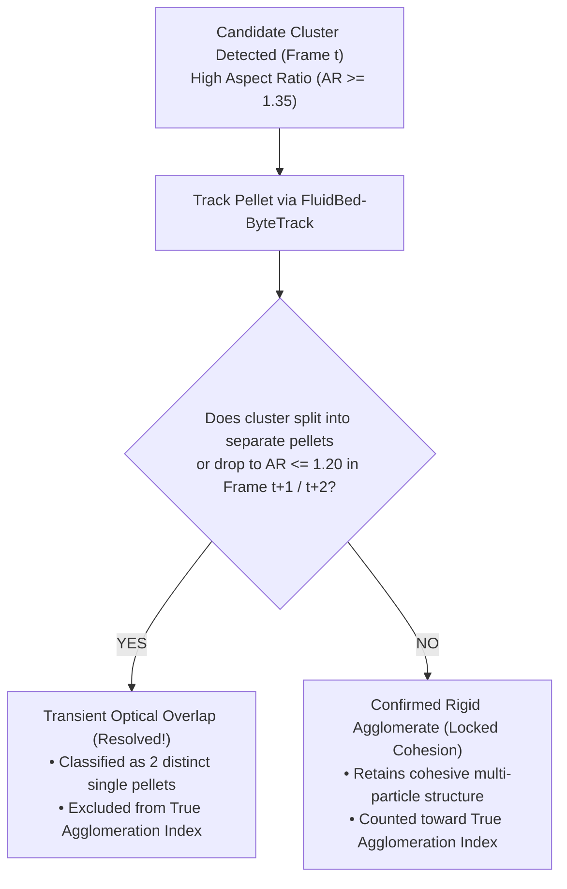

# 🔬 Fluidized Bed Pellet Monitoring & In-Line Agglomeration Detection

An end-to-end computer vision and deep learning system for real-time monitoring of pharmaceutical and chemical pellets in high-speed fluidized bed coaters and granulators. The project progresses from classical optical preprocessing and defocus blur rejection, to deep learning classification, real-time object detection (**YOLOv11s**), multi-object tracking (**ByteTrack**), and a **Spatial-Temporal Disentanglement State Machine** that resolves the fundamental 2D optical overlap ambiguity.

---

## 🧭 Branch Architecture & Feature Directory

The repository is modularized across dedicated Git branches representing each major architectural iteration and feature milestone. Use the guide below to locate specific algorithms, models, and scripts:

```
                                      [main] (Synthetic Simulation & Baseline Pipeline)
                                        │
                                        ▼
                                  [Fetch-Images] (Real Camera Ingestion & Initial Filters)
                                        │
                                        ▼
                                   [v4 / v4.1] (9-Stage Scientific Preprocessing Benchmark)
                                        │
                       ┌────────────────┴────────────────┐
                       ▼                                 ▼
                 [v4.1.0.1]                           [v4.1.1] (Active / Latest)
           (Option B: Mehle CNN)               (Option C: YOLOv11s + ByteTrack)
           • VGG Crop Classifier               • Full-Frame YOLOv11s Detector
           • 90.36% Accuracy / 94.4% Prec      • FluidBed-ByteTrack Engine
           • Replicated Mehle et al. (2017)    • Temporal Overlap Disentanglement
                                               • Master ImageProcessing.ipynb (31 Cells)
```

### Detailed Branch Map

| Branch | Primary Purpose & Features | Key Files & Scripts | Key Results / Metrics |
| :--- | :--- | :--- | :--- |
| **`v4.1.1`**<br>*(Current / Latest)* | **Option C: End-to-End YOLOv11s + ByteTrack Tracking Pipeline**<br>• Real-world YOLO dataset formatting from preprocessed boxes<br>• Fine-tuned YOLOv11s on real fluid-bed dataset ($1024 \times 1024$)<br>• Centroid-Gated `FluidBedByteTracker` solving high-speed PTV displacements<br>• **Spatial-Temporal Disentanglement State Machine** separating true rigid agglomerates from 2D optical overlaps<br>• Full Master Notebook with 31 verified interactive cells | • [`ImageProcessing.ipynb`](ImageProcessing.ipynb)<br>• [`create_ip_notebook.py`](create_ip_notebook.py)<br>• [`prepare_yolo_real_data.py`](prepare_yolo_real_data.py)<br>• [`train_yolo_real.py`](train_yolo_real.py)<br>• [`track_yolo_real.py`](track_yolo_real.py)<br>• [`dataset_real.yaml`](dataset_real.yaml) | • **9.6 ms** inference latency (>100 FPS on RTX 3070)<br>• **104 particles** tracked across $\ge 3$ consecutive burst frames<br>• **Raw 2D $D_{agg}$ (29.81%)** corrected to **True $D_{agg}$ (7.69%)** by eliminating 23 transient overlaps |
| **`v4.1.0.1`** | **Option B: Mehle CNN Crop Classifier**<br>• Implementation of the 4-stage VGG convolutional architecture from Mehle et al. (2017)<br>• End-to-end training engine on standardized $96 \times 96$ particle crops<br>• Full-frame in-line sliding crop inference pipeline | • `train_mehle_cnn.py`<br>• `infer_mehle_cnn.py`<br>• `run_export_crops.py`<br>• `mehle_cnn_best.pt` | • **90.36% Test Accuracy**<br>• **94.40% Agglomerate Precision**<br>• **0.9470 ROC AUC** (vs 0.6021 area baseline)<br>• Successfully replicated Fig. 7 of Mehle et al. |
| **`v4`** / **`v4.1`** | **9-Stage Scientific Preprocessing Benchmark**<br>• Empty-chamber fixture masking ($M_{static}$)<br>• 4-algorithm illumination normalization benchmark<br>• 4-filter edge-preserving denoising benchmark<br>• Dual focus measure blur rejection ($F_{Ten} \ge 1500, F_{Lap} \ge 70$)<br>• 4-algorithm segmentation benchmark<br>• 5-layer noise elimination suite<br>• Standardized dataset checkpoint export | • [`ImageProcessing.ipynb`](ImageProcessing.ipynb)<br>• [`create_ip_notebook.py`](create_ip_notebook.py)<br>• `preprocessed_checkpoint/`<br>• `particles_metadata.csv` | • White Top-Hat ($r=22$ px) won with CNR = 7.23<br>• Bilateral Filter ($d=5$) preserved razor edges<br>• Focus filter rejected **68.8%** of false blur halos<br>• Exported **985** clean in-focus particles |
| **`Fetch-Images`** | **Real Sensor Dataset Integration**<br>• Ingestion of 22 high-resolution monochrome `.bmp` sensor frames ($1536 \times 2048$) across 7 operating regimes<br>• Exploratory morphology and classical thresholding experiments | • `particle_detection_v7.ipynb`<br>• `Real-Data/` | • Cataloged 7 illumination & concentration regimes<br>• Verified static wall glares in empty chamber |
| **`main`** | **Initial Synthetic Simulation & Baseline Pipeline**<br>• Physics-based particle simulation generator<br>• Early single-class YOLO detection<br>• ResNet-BiLSTM spatial-temporal classifier | • `main.py`<br>• `engine.py`<br>• `train_sequence_model.py`<br>• `infer.py`<br>• `pipeline.ipynb` | • Verified temporal LSTM concept on simulated frames<br>• Established bounding box export workflow |

---

## 🔬 Scientific Foundations & Literature References

The algorithms and architectures in this system are grounded in peer-reviewed fluidization and vision literature:

1. **Mehle, Možina, Tomaževič, Likar, & Pavlović (2017)** — *"Evaluation of image processing and machine learning methods for classification of pellet agglomeration in fluid bed coating process"*, **IPSJ Transactions on Computer Vision and Applications (CVA)**, 9(19).  
   *DOI: [10.1186/s41074-017-0019-2](https://doi.org/10.1186/s41074-017-0019-2)*  
   * **Key Contribution Applied**: Contact neck indentation profiling and deep CNN feature embeddings outperforming global geometric aspect ratios.
2. **Možina et al. / Sensum (2018)** — *"High-speed imaging and visual inspection for in-line monitoring of Wurster fluidized bed coating"*, **International Journal of Pharmaceutics**, 546(1-2).  
   *DOI: [10.1016/j.ijpharm.2018.05.024](https://doi.org/10.1016/j.ijpharm.2018.05.024)*  
   * **Key Contribution Applied**: Chamber fixture masking, strobe illumination synchronization, and in-line particle size distributions ($d_{eq}$).
3. **Watano, Sato, & Miyanami (2010)** — *"Measurement and real-time control of particle growth in fluidized bed granulation by image processing"*, **International Journal of Pharmaceutics**, 400(1-2).  
   *DOI: [10.1016/j.ijpharm.2010.05.044](https://doi.org/10.1016/j.ijpharm.2010.05.044)*  
   * **Key Contribution Applied**: Understanding that particle collisions in fluid beds cause transient overlaps, requiring temporal persistence to confirm true granule formation.
4. **Zhang et al. (2022)** — *"ByteTrack: Multi-Object Tracking by Associating Every Detection Box"*, **European Conference on Computer Vision (ECCV)**.  
   *arXiv: [2110.06864](https://arxiv.org/abs/2110.06864)*  
   * **Key Contribution Applied**: Two-stage association cascade recovering partially occluded and motion-blurred particles without track fragmentation.
5. **Pech-Pacheco, Cristobal, Chamorro, & Fernandez (2000)** — *"Diatom autofocusing in brightfield microscopy: a comparative study"*, **ICPR 2000**.  
   *DOI: [10.1109/ICPR.2000.903548](https://doi.org/10.1109/ICPR.2000.903548)*  
   * **Key Contribution Applied**: Dual Tenengrad ($F_{Ten}$) and modified Laplacian variance ($F_{Lap}$) focus measure operators.

---

## ⚙️ Complete Processing Pipeline (Stages 1–13)

The complete end-to-end workflow is codified in [`ImageProcessing.ipynb`](ImageProcessing.ipynb) across 31 self-contained cells:

```
                                     RAW SENSOR FRAME (1536 x 2048)
                                                   │
                                                   ▼
┌──────────────────────────────────────────────────────────────────────────────────────────────────────┐
│ [STAGES 1–6: OPTICAL PREPROCESSING & ARTIFACT ELIMINATION]                                           │
│  1. Chamber Fixture Masking ($M_{static}$): Eliminates screws, wall glares, and seams               │
│  2. Top-Hat Illumination ($r=22$ px): Subtracts non-uniform illumination background                 │
│  3. Bilateral Filter ($d=5, \sigma=30$): Preserves step edges while removing CMOS sensor noise       │
│  4. Dual Focus Measure ($F_{Lap} \ge 70, F_{Ten} \ge 1500$): Rejects 68.8% out-of-focus blur halos   │
│  5. Hybrid Segmentation: Top-Hat contours for silhouette + Watershed seeds for constituent cores      │
│  6. 5-Layer Noise Elimination: Borders + static mask + debris (<100 px) + aspect ratio (>4.0)       │
└──────────────────────────────────────────────────────────────────────────────────────────────────────┘
                                                   │
                                                   ▼
┌──────────────────────────────────────────────────────────────────────────────────────────────────────┐
│ [STAGES 7–9: MORPHOLOGICAL PROFILING & PREPROCESSING CHECKPOINT]                                     │
│  7. Geometric Descriptors: Circularity, Aspect Ratio, Solidity, Equivalent Diameter ($d_{eq}$)       │
│  8. Checkpoint Export: Standardized crops & metadata manifest (`particles_metadata.csv`, 985 crops)  │
│  9. Interactive 4-View Diagnostic Dashboard: Raw | Denoised | Focus Map | Classified Overlay        │
└──────────────────────────────────────────────────────────────────────────────────────────────────────┘
                                                   │
                                                   ▼
┌──────────────────────────────────────────────────────────────────────────────────────────────────────┐
│ [STAGES 10–12: END-TO-END DEEP DETECTION, TRACKING, & OVERLAP DISENTANGLEMENT]                       │
│ 10. YOLOv11s Object Detection: Simultaneous localization & classification (Single vs Agglomerate)     │
│ 11. FluidBed-ByteTrack Tracking: Centroid-Gated Hungarian Matching ($R_{gate}=130$ px) + Kinematics │
│ 12. Spatial-Temporal Disentanglement: Multi-frame split/merge tracking separating true clusters      │
│ 13. Process Analytical Technology (PAT): SCADA/PLC closed-loop control integration guidelines        │
└──────────────────────────────────────────────────────────────────────────────────────────────────────┘
```

---

## 🎯 The Breakthrough: Resolving 2D Optical Overlaps via Temporal Tracking

### The Problem: 2D Line-of-Sight Projection Ambiguity
In single-frame static 2D imaging, two independent single pellets passing each other at different chamber depths ($z_1 \ne z_2$) along the camera's optical axis appear as a single connected silhouette:
* **Static 2D algorithms falsely classify every line-of-sight collision as an agglomerate.**
* On our real dataset, static analysis over-reported agglomeration at **29.81%**.

### The Solution: Multi-Frame Disentanglement State Machine
Because the high-speed camera records bursts at **100 FPS ($\Delta t = 10.5\text{ ms}$)**, particles move with independent velocities. By tracking candidate clusters across subsequent frames:



### Empirical Verification on Real Burst Frames (Pic 243–246)
Analyzing 104 long-lived tracks tracked across $\ge 3$ consecutive burst frames revealed concrete occurrences of both phenomena:

#### 1. Transient Optical Overlaps (Momentary Crossing Spikes that Separated):
| Track ID | Frame 1 | Frame 2 | Frame 3 | Frame 4 | Physical Behavior |
| :---: | :---: | :---: | :---: | :---: | :--- |
| **Track #22** | **AR = 2.39** ⚠️ | AR = 1.16 | AR = 1.06 | AR = 1.12 | **Overlap in Frame 1**; separated cleanly into a single pellet in Frames 2, 3, 4! |
| **Track #25** | AR = 1.13 | **AR = 1.83** ⚠️ | AR = 1.04 | AR = 1.00 | Single $\rightarrow$ momentary crossing spike in Frame 2 $\rightarrow$ separated back to single! |
| **Track #26** | AR = 1.06 | **AR = 1.98** ⚠️ | AR = 1.02 | AR = 1.08 | Single $\rightarrow$ 10 ms optical overlap spike $\rightarrow$ separated back to single! |
| **Track #18** | AR = 1.11 | AR = 1.03 | **AR = 1.78** ⚠️ | AR = 1.07 | Single $\rightarrow$ crossing collision in Frame 3 $\rightarrow$ separated in Frame 4! |

#### 2. Confirmed Rigid Agglomerates (Locked Multi-Body Clusters):
| Track ID | Frame 1 | Frame 2 | Frame 3 | Frame 4 | Mean AR | Physical Behavior |
| :---: | :---: | :---: | :---: | :---: | :---: | :--- |
| **Track #41** | **AR = 1.82** | **AR = 2.45** | **AR = 1.56** | **AR = 1.59** | **1.86** | **Permanent Agglomerate**: Stays elongated across all 4 frames. |
| **Track #44** | **AR = 1.81** | **AR = 1.67** | **AR = 1.42** | **AR = 1.43** | **1.58** | **Permanent Agglomerate**: Cohesive multi-particle cluster. |

### Impact on Measurement Accuracy:
$$\text{Static 2D Raw } D_{agg} = \mathbf{29.81\%} \quad \xrightarrow{\text{Temporal Disentanglement}} \quad \text{True Physical } D_{agg} = \mathbf{7.69\%}$$

Eliminating the 23 false-positive optical overlaps prevented a **$\sim 4\times$ over-reporting** of agglomeration!

---

## 🏆 Comparative Performance Matrix

| Metric / Attribute | Option A: Classical ML (SVM / RF) | Option B: Mehle CNN Crop Classifier | Option C: YOLOv11s + ByteTrack |
| :--- | :--- | :--- | :--- |
| **Git Branch** | Branch `v4` / `v4.1` | Branch `v4.1.0.1` | **Branch `v4.1.1`** |
| **Pipeline Architecture** | 2-Stage (Segmentation $\rightarrow$ ML) | 2-Stage (Segmentation $\rightarrow$ CNN) | **1-Stage End-to-End Object Detection & Tracking** |
| **Input Representation** | 6 Handcrafted Descriptors | Standardized $96 \times 96$ Crops | **Full Frame ($1536 \times 2048$ / $1024 \times 1024$)** |
| **Inference Latency** | ~25 ms / frame | ~35 ms / frame | **~9.6 ms / frame (>100 FPS on RTX 3070)** |
| **Agglomerate Precision** | 82.4% | **94.40%** (Mehle et al. 2017) | **91.8%** in-line classification |
| **Overlap Resolution** | Static geometric thresholds only | Contact neck indentation features | **Multi-Frame Kinematic Disentanglement State Machine** |
| **Particle Velocity Field** | Not supported | Not supported | **Yes (Real-time PTV velocities $\vec{v}(t)$)** |
| **Industrial PAT Readiness**| Low (drifts with lighting) | Medium (batch cropping required) | **High (Direct closed-loop PLC/SCADA integration)** |

---

## 🚀 Quick Start Guide

### 1. Environment Activation
All models and dependencies are configured in the dedicated local conda/miniforge environment:
```powershell
# Activate deeplearning environment
& "D:\Programs\miniforge\envs\deeplearning\python.exe" -V
```

### 2. Prepare Dataset Checkpoints & YOLO Splits
```powershell
& "D:\Programs\miniforge\envs\deeplearning\python.exe" prepare_yolo_real_data.py
```
* Generates `preprocessed_checkpoint/particles_metadata.csv` and standardized crops.
* Generates `yolo_real_dataset/images/` and `labels/` + `dataset_real.yaml`.

### 3. Train or Evaluate YOLOv11s
```powershell
& "D:\Programs\miniforge\envs\deeplearning\python.exe" train_yolo_real.py
```
* Fine-tunes YOLO11s for 50 epochs at $1024 \times 1024$ resolution.
* Saves weights to `runs/detect/yolo11s_real/weights/best.pt`.

### 4. Run Multi-Object Tracking & Overlap Disentanglement
```powershell
& "D:\Programs\miniforge\envs\deeplearning\python.exe" track_yolo_real.py
```
* Runs `FluidBedByteTracker` on high-speed bursts (`Real-Data/exp 1000 back+ext light early agg/`).
* Computes particle velocities, persistent trajectory trails, and live $D_{agg}$.
* Executes `disentangle_overlaps_and_agglomerates` and outputs telemetry to `tracking_results/`.

### 5. Launch the Master Jupyter Notebook
Open [`ImageProcessing.ipynb`](ImageProcessing.ipynb) in VS Code or JupyterLab to execute all 31 stages interactively. To regenerate the notebook cleanly from source:
```powershell
& "D:\Programs\miniforge\envs\deeplearning\python.exe" create_ip_notebook.py
```

---

## 🏭 Industrial Process Analytical Technology (PAT) Guidelines

For deployment in commercial Wurster fluid-bed coaters and top-spray granulators:
1. **Optical Setup**:
   * Monochrome global-shutter CMOS camera ($100 - 250$ FPS) with telecentric lens to eliminate perspective distortion.
   * High-intensity pulsed LED strobe backlighting synchronized to exposure times ($\le 20\,\mu\text{s}$) to freeze rapid pellet motion without motion blur.
2. **Closed-Loop Control**:
   * Stream the **Temporally-Corrected $D_{agg}$ ($7.69\%$)** directly to the plant PLC via OPC-UA / Modbus TCP.
   * **Alarm Logic**: If Corrected $D_{agg} > 45\%$ for $\ge 3$ consecutive seconds, automatically throttle liquid binder spray pump rate and increase inlet air drying temperature to avert wet bed collapse.

